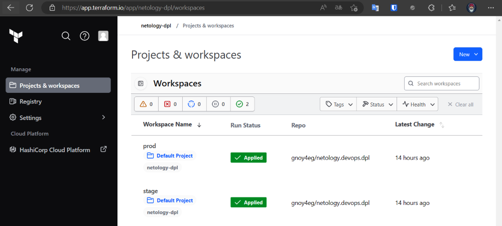
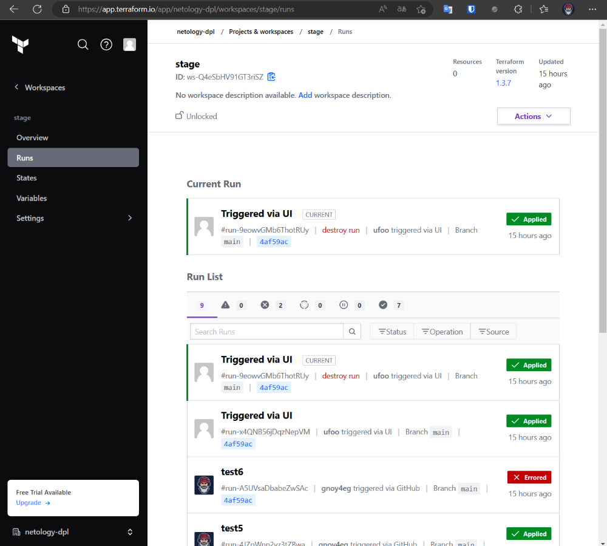

## Создание облачной инфраструктуры

В первую очередь, создам сервисный аккаунт в YC, для Terraform Cloud и назначу ему необходимые права (admin) т.к. в будущем, мне потребуется автоматически создать дополнительные сервисные аккаунты для разных окружений.  
Проверяю:  
```bash
❯ yc iam service-account get --name tf-robot
id: aje2umvb1o78915qdmgb
folder_id: b1g27gpcstr1l1bi3a22
created_at: "2023-01-27T13:20:20Z"
name: tf-robot
description: Сервисный аккаунт для Terraform Cloud
```

Подготовил [backend](../terraform/provider.tf) для Terraform Cloud.  
Залогинюсь в Terraform Cloud, используя API Token:

<details>
    <summary>Вывод CLI</summary>
    
```bash
❯ terraform login
Terraform will request an API token for app.terraform.io using your browser.

If login is successful, Terraform will store the token in plain text in
the following file for use by subsequent commands:
    /home/schipyshev/.terraform.d/credentials.tfrc.json

Do you want to proceed?
  Only 'yes' will be accepted to confirm.

  Enter a value: yes


---------------------------------------------------------------------------------

/usr/bin/x-www-browser: line 108: /c/Windows/System32/reg.exe: No such file or directory
/usr/bin/x-www-browser: line 98: /c/Windows/System32/chcp.com: No such file or directory
/usr/bin/x-www-browser: line 103: /c/Windows/System32/WindowsPowerShell/v1.0/powershell.exe: No such file or directory
/usr/bin/x-www-browser: line 98: /c/Windows/System32/chcp.com: No such file or directory
/usr/bin/xdg-open: 869: firefox: not found
/usr/bin/xdg-open: 869: iceweasel: not found
/usr/bin/xdg-open: 869: seamonkey: not found
/usr/bin/xdg-open: 869: mozilla: not found
/usr/bin/xdg-open: 869: epiphany: not found
/usr/bin/xdg-open: 869: konqueror: not found
/usr/bin/xdg-open: 869: chromium: not found
/usr/bin/xdg-open: 869: chromium-browser: not found
/usr/bin/xdg-open: 869: google-chrome: not found
/usr/bin/www-browser: line 108: /c/Windows/System32/reg.exe: No such file or directory
/usr/bin/www-browser: line 98: /c/Windows/System32/chcp.com: No such file or directory
/usr/bin/www-browser: line 103: /c/Windows/System32/WindowsPowerShell/v1.0/powershell.exe: No such file or directory
/usr/bin/www-browser: line 98: /c/Windows/System32/chcp.com: No such file or directory
/usr/bin/xdg-open: 869: links2: not found
/usr/bin/xdg-open: 869: elinks: not found
/usr/bin/xdg-open: 869: links: not found
/usr/bin/xdg-open: 869: lynx: not found
/usr/bin/xdg-open: 869: w3m: not found
xdg-open: no method available for opening 'https://app.terraform.io/app/settings/tokens?source=terraform-login'
Open the following URL to access the tokens page for app.terraform.io:
    https://app.terraform.io/app/settings/tokens?source=terraform-login


---------------------------------------------------------------------------------

Generate a token using your browser, and copy-paste it into this prompt.

Terraform will store the token in plain text in the following file
for use by subsequent commands:
    /home/schipyshev/.terraform.d/credentials.tfrc.json

Token for app.terraform.io:
  Enter a value:


Retrieved token for user api-org-netology-dpl-fuT7KpsJFX


---------------------------------------------------------------------------------

                                          -
                                          -----                           -
                                          ---------                      --
                                          ---------  -                -----
                                           ---------  ------        -------
                                             -------  ---------  ----------
                                                ----  ---------- ----------
                                                  --  ---------- ----------
   Welcome to Terraform Cloud!                     -  ---------- -------
                                                      ---  ----- ---
   Documentation: terraform.io/docs/cloud             --------   -
                                                      ----------
                                                      ----------
                                                       ---------
                                                           -----
                                                               -


   New to TFC? Follow these steps to instantly apply an example configuration:

   $ git clone https://github.com/hashicorp/tfc-getting-started.git
   $ cd tfc-getting-started
   $ scripts/setup.sh
```


</details>


Инициализирую terraform, создаю workspaces:

<details>
    <summary>Вывод CLI</summary>

```bash
❯ terraform init

Initializing Terraform Cloud...

No workspaces found.

  There are no workspaces with the configured tags (netology-dpl)
  in your Terraform Cloud organization. To finish initializing, Terraform needs at
  least one workspace available.

  Terraform can create a properly tagged workspace for you now. Please enter a
  name to create a new Terraform Cloud workspace.

  Enter a value: stage


Initializing provider plugins...
- Finding latest version of yandex-cloud/yandex...
- Installing yandex-cloud/yandex v0.84.0...
- Installed yandex-cloud/yandex v0.84.0 (self-signed, key ID E40F590B50BB8E40)

Partner and community providers are signed by their developers.
If you'd like to know more about provider signing, you can read about it here:
https://www.terraform.io/docs/cli/plugins/signing.html

Terraform has created a lock file .terraform.lock.hcl to record the provider
selections it made above. Include this file in your version control repository
so that Terraform can guarantee to make the same selections by default when
you run "terraform init" in the future.

Terraform Cloud has been successfully initialized!

You may now begin working with Terraform Cloud. Try running "terraform plan" to
see any changes that are required for your infrastructure.

If you ever set or change modules or Terraform Settings, run "terraform init"
again to reinitialize your working directory.
❯ terraform workspace new prod
Created and switched to workspace "prod"!

You're now on a new, empty workspace. Workspaces isolate their state,
so if you run "terraform plan" Terraform will not see any existing state
for this configuration.
```

</details>

Проверяю их:
```bash
❯ terraform workspace list
* prod
  stage
```
---

**Дополнительно я хочу что бы инфраструктура разворачивалась автоматически по push'у в git.**   
Проведу некоторые настройки в Terraform Cloud UI, добавлю var'сы и сделаю привязку к репозиторию в git'е.  

**Workspace stage**  
Добавлено:    
- Автоматический plan + apply в YC по push'у в ветку main
- variables TF_VAR_WORKSPACE_NAME = stage
- variable TF_VAR_YANDEX_FOLDER_ID = b1g1evu0p0bre4qiiut9
- variable set TF_VAR_YC_CREDENTIAL = содержимое key.json (`yc iam key create --service-account-name tf-robot --output key.json`)

**Workspace prod**  
Добавлено:    
- Автоматический plan **по тегу**, ручной apply в YC
- variables TF_VAR_WORKSPACE_NAME = prod
- variable TF_VAR_YANDEX_FOLDER_ID = b1gjoj6p2asu37u60va7
- variable set TF_VAR_YC_CREDENTIAL = содержимое key.json (`yc iam key create --service-account-name tf-robot --output key.json`)

Убеждаюсь, что все работает:  

workspaces:
<p align="left">
  
</p> 

prod:  
<p align="left">
  
</p> 

stage:
<p align="left">
  
</p> 


<br>


[На главную](../README.md)