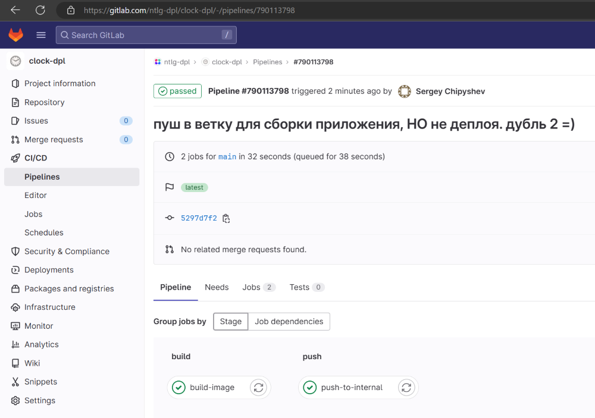
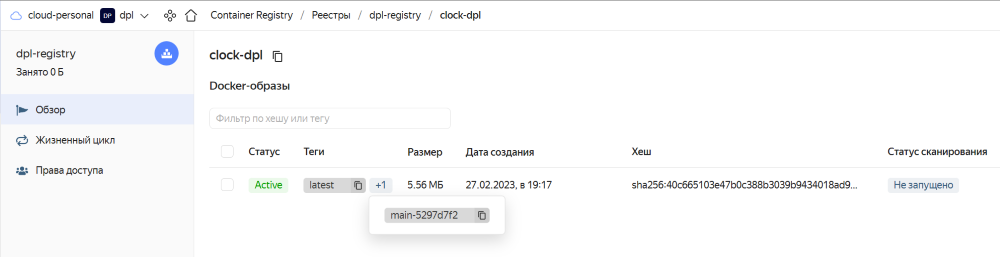
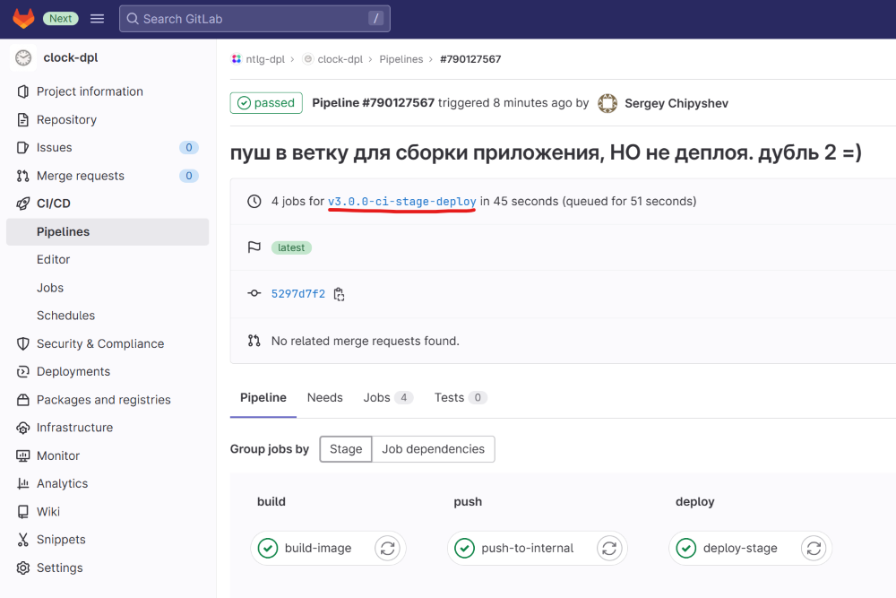
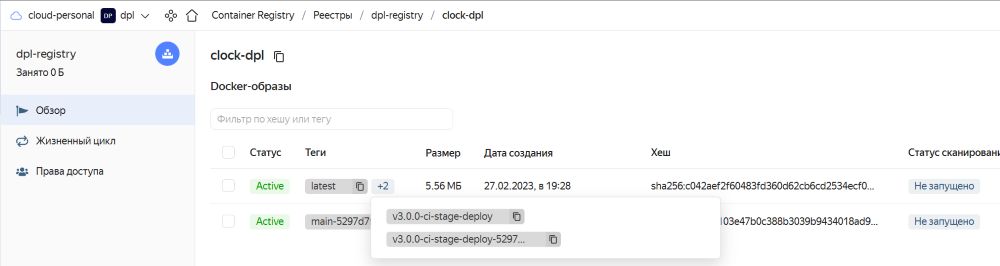
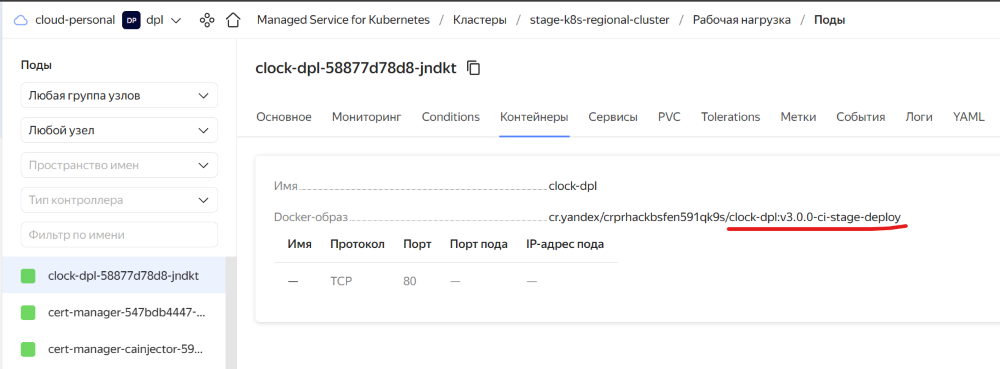
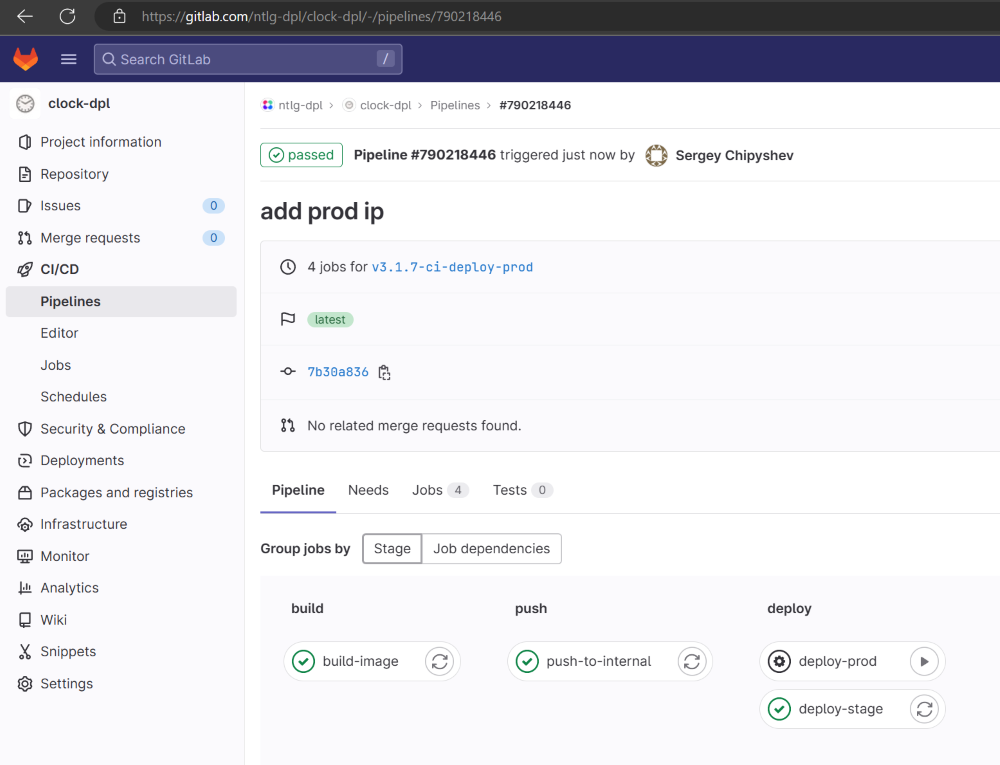
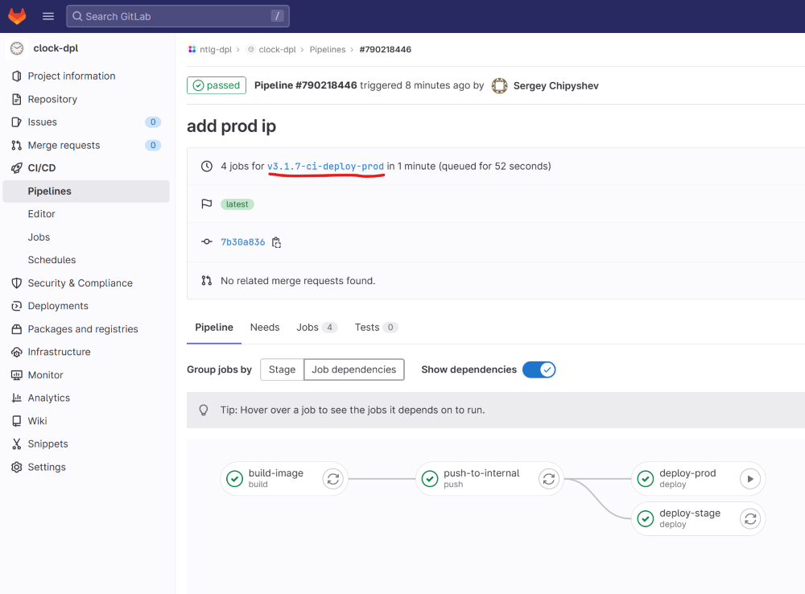
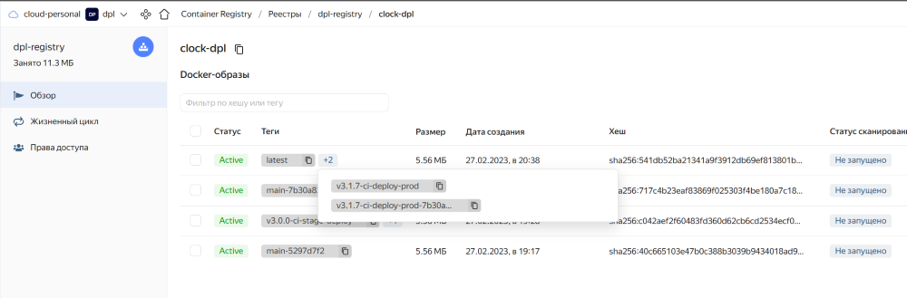
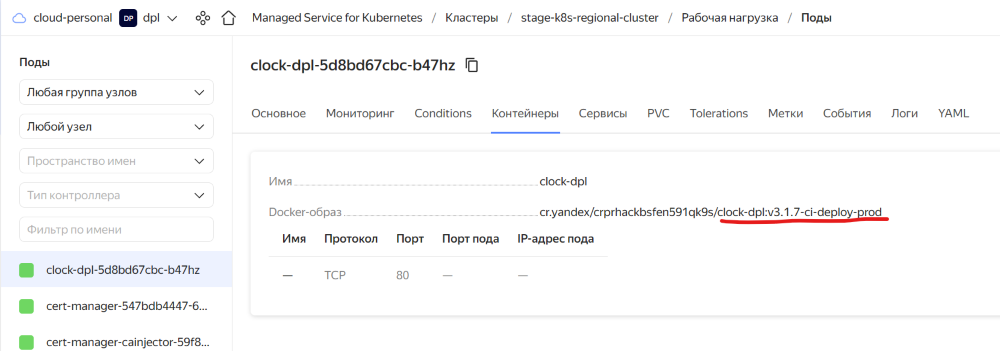
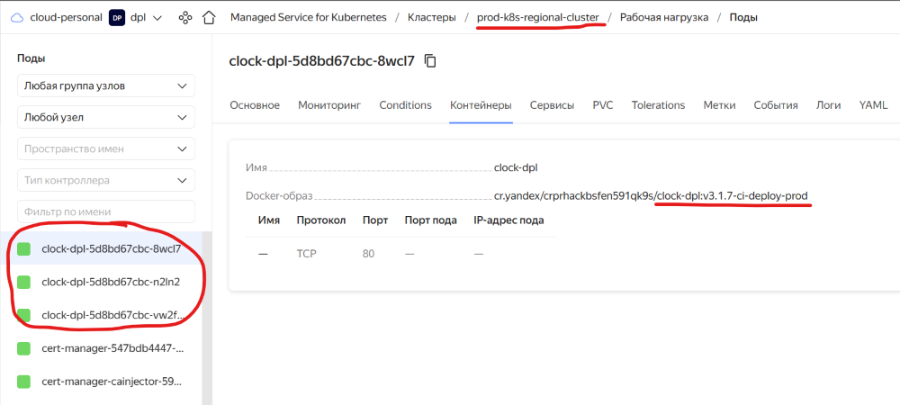

## Установка и настройка CI/CD

 

**[ССЫЛКА](https://gitlab.com/ntlg-dpl/clock-dpl)** на тестовое приложение в gitlab.com   

 

В процессе выполнения дипломной работы я имею два окружения - stage и prod.   
Именно по этой причине, у меня будет некоторое требование по именованию тега:
- prod. В конце тег должен иметь запись `-prod`, для деплоя новой версии приложения на продуктовый стенд и, при этом, установка будет производиться в ручную.   
- stage. Не имеет требования по именованию тега, установка происходит по созданию любого тега в репозитории, в автоматическом режиме.     

Сборка приложения происходит по любому коммиту в репозиторий, образ пушится в реджестри с тегом хеша из коммита. Артефакты сборки можно посмотреть в разделе CI/CD.

Итак, приступим!    
В первую очередь, мне нужен образ для деплоя моего приложения в кластер k8s средствами qbec. Подготовил [Dockerfile](../gitlab.com/qbec/qbec-deployer/Dockerfile), собрал образ и за'push'ил его на [hub.docker.com](https://hub.docker.com/r/foo4/qbec-builder/tags). Далее в CI/CD буду им пользоваться.   
Подготовил [.gitlab-ci.yml](../gitlab.com/.gitlab-ci.yml)   
Для работы скрипта из CI/CD мне так же понадобится переменная на gitlab.com - `$KUBECONFIG_YC`    
В этой переменной будет указан конфиг для подключения к кластеру k8s в YC. Необходимый контекст в скрипте будет меняться в зависимости от места (stage, prod) деплоя приложения.

 

Проверяю работу CI/CD.   
Пушу коммит в репозиторий. Проверяю, что образ собрался и улетел в регистри YC.

  

 

  

 

Теперь создам любой тег, отличный от `-prod` и посмотрю как приложение установится на стенд stage

  

 

  

 
Проверяю, что приложение задеплоилось в k8s с необходимым тегом

  

 
Проверяю как работает деплой приложения на prod-стенд.       

Как видно, что stage-стенд тоже получил автоматически обновление до новой версии приложения.          
Prod обновляется "по кнопке"  

  

 

  

 

  

Проверю версии приложений в кластерах k8s

  

  

 

[На главную](../README.md)
