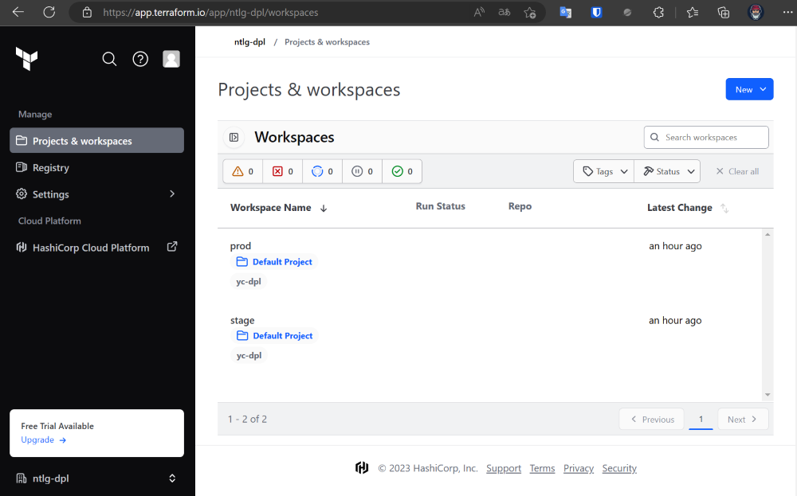
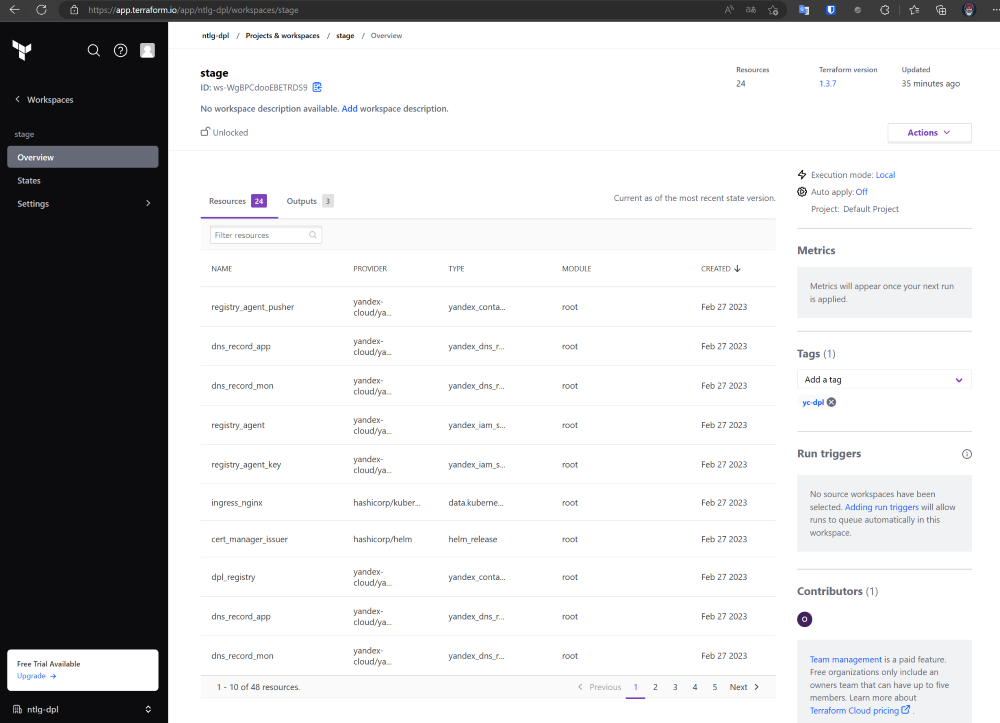
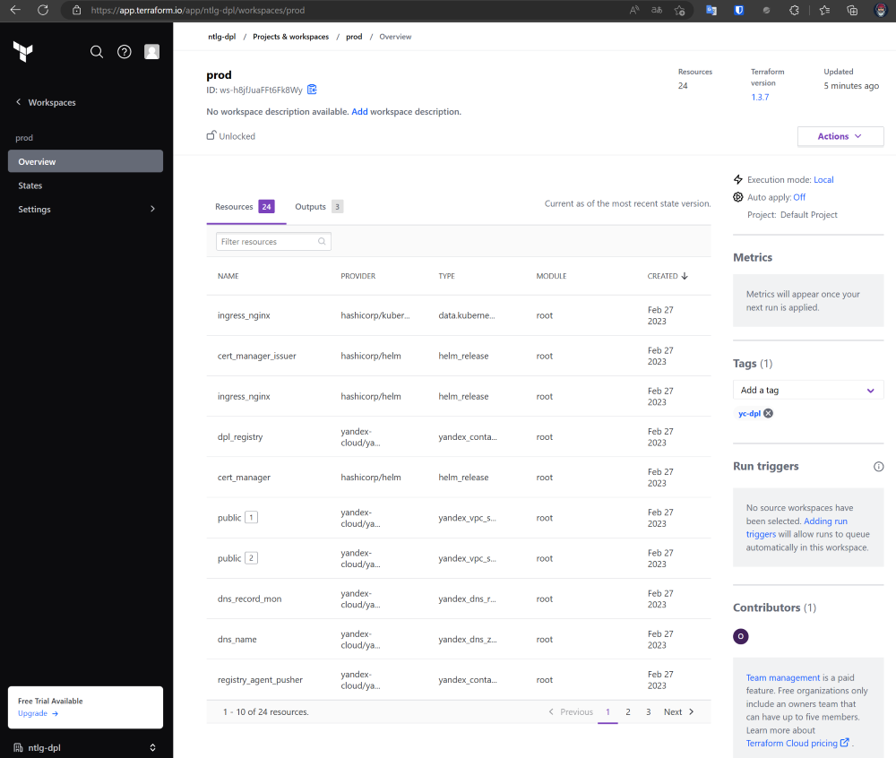
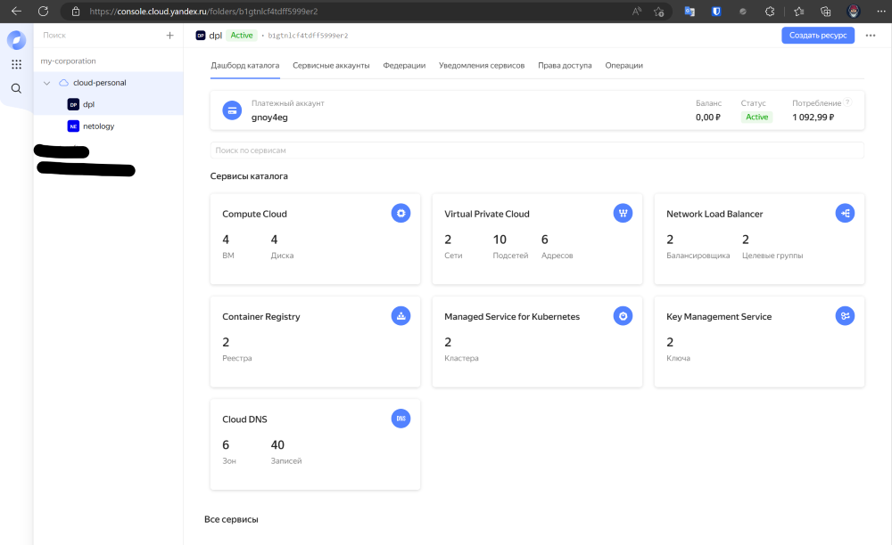
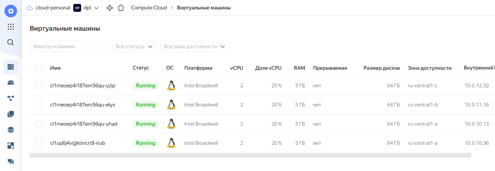
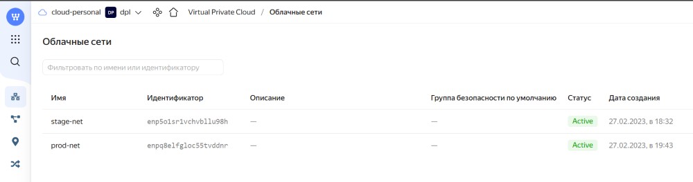
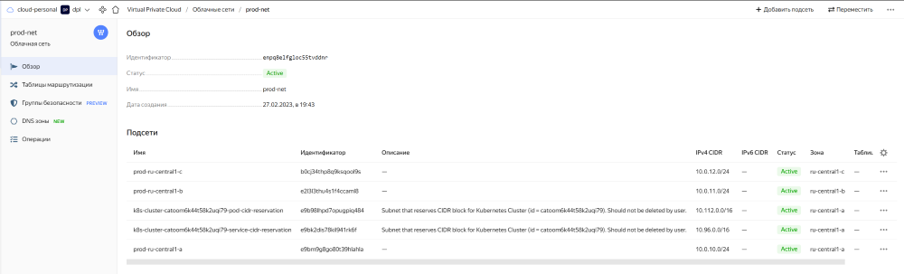
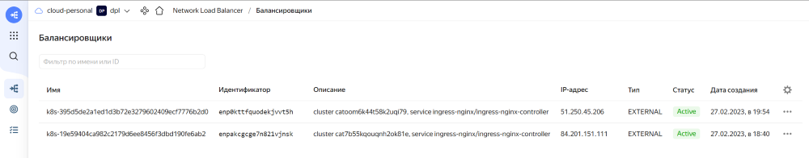
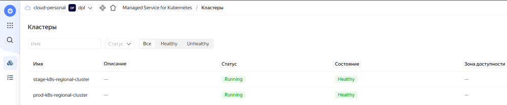

## Итоговый результат

Для демонстрации работы окружений приложу скриншоты из ЛК.    
Ссылки на работающие приложения и мониторинг (с логином\паролем) находятся на главной странице (ссылка с самом низу страницы).   

Terraform Cloud:

  

 

stage:

  

 

prod:

  

 

Созданные инстансы в YC

  

 

  

 

  

 

  

 

  

 

  

 

 

[На главную](../README.md)
